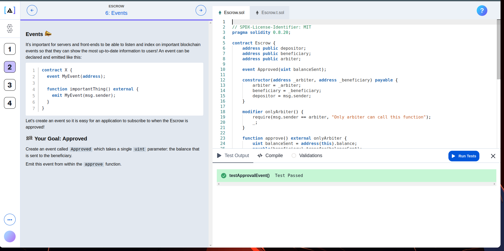

# Address Interactions

## sending ether

**Practice sending ether**

# Reverting Transactions

**Practice revert transactions**

# Calling Contracts

**Practice Calling Contracts**

# Escrow

**Practice Escrow**

